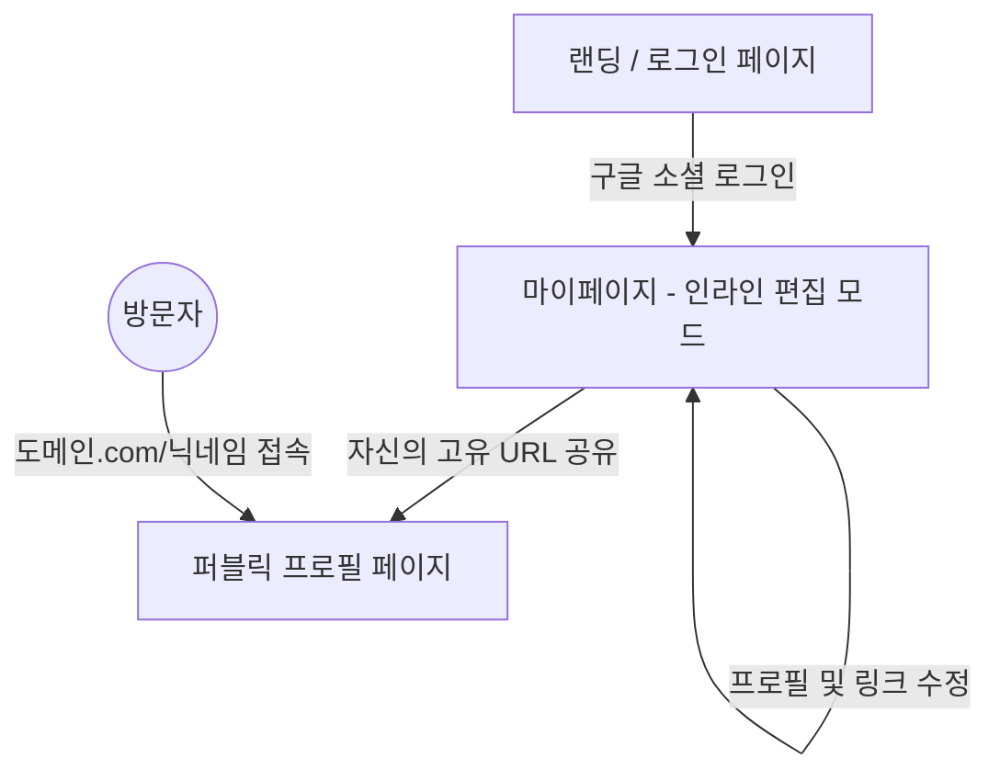

# 마이링크(My Link) 와이어프레임 및 화면 설계서

본 문서는 마이링크 서비스의 화면 구성과 사용자 인터페이스(UI) 배치를 시각적으로 정의합니다. 
전체적인 레이아웃은 모바일 가독성을 최우선으로 고려한 **세로형 단일 컬럼(Single Column) 구조**를 채택하고 있습니다. (데스크톱에서도 가운데 정렬된 모바일 폭을 유지합니다.)

---

## 1. 페이지 탐색 구조 (Mermaid Flow)

사용자와 소유자(크리에이터)가 서비스 내에서 어떻게 페이지를 이동하는지 보여주는 흐름도입니다.
편집 기능은 퍼블릭 페이지가 아닌 **마이페이지(My Page)**에서만 가능하도록 분리되었습니다.



---

## 2. 화면별 와이어프레임 (ASCII Art)

Shadcn UI 특유의 깔끔하고 모던한 카드형(Card) 디자인과 둥근 모서리(Rounded) 느낌을 표현한 ASCII 와이어프레임입니다.

### 2.1 랜딩 및 로그인 페이지 (`/`)
서비스에 처음 진입했을 때 보이는 화면입니다. 복잡한 폼 없이 구글 로그인 버튼 하나만 제공하여 진입 장벽을 낮춥니다.

```text
 ┌─────────────────────────────────────────┐
 │                                         │
 │                                         │
 │               My Link                   │
 │                                         │
 │       나만의 흩어진 링크들을            │
 │       하나의 페이지로 모아보세요.       │
 │                                         │
 │                                         │
 │   ╭─────────────────────────────────╮   │
 │   │   [G] Google 계정으로 시작하기  │   │
 │   ╰─────────────────────────────────╯   │
 │                                         │
 │                                         │
 │                                         │
 └─────────────────────────────────────────┘
```

### 2.2 퍼블릭 뷰어 페이지 (`/닉네임`)
방문자가 고유 URL을 통해 접속했을 때 보는 화면입니다. 편집 기능은 전혀 노출되지 않으며, 링크 클릭(조회수 카운트) 기능만 활성화됩니다.

```text
 ┌─────────────────────────────────────────┐
 │                                         │
 │                                         │
 │               홍길동 (username)         │
 │                  @gildong               │
 │                                         │
 │         "프론트엔드 개발자입니다.       │
 │          환영합니다!"                   │
 │                                         │
 │                                         │
 │   ╭─────────────────────────────────╮   │
 │   │ [파비콘]  GitHub 포트폴리오     │   │
 │   ╰─────────────────────────────────╯   │
 │                                         │
 │   ╭─────────────────────────────────╮   │
 │   │ [파비콘]  개인 기술 블로그      │   │
 │   ╰─────────────────────────────────╯   │
 │                                         │
 │   ╭─────────────────────────────────╮   │
 │   │ [파비콘]  인스타그램 계정       │   │
 │   ╰─────────────────────────────────╯   │
 │                                         │
 │            Powered by My Link           │
 └─────────────────────────────────────────┘
```

### 2.3 마이페이지 - 편집 모드 (`/mypage`)
소유자가 로그인 후 진입하는 프라이빗 대시보드입니다. 퍼블릭 뷰어와 시각적으로 거의 동일하지만, 각 텍스트 요소가 **인라인 편집(Inline Edit)** 가능 상태이며, 링크 추가 및 삭제 아이콘이 표시됩니다.

```text
 ┌─────────────────────────────────────────┐
 │ [로그아웃]                마이페이지    │
 │                                         │
 │           [ ✏️ 홍길동 (수정) ]          │
 │                 @gildong                │
 │                                         │
 │         [ ✏️ 프론트엔드 개발자입니다.   │
 │            환영합니다! (수정) ]         │
 │                                         │
 │                                         │
 │   ╭─────────────────────────────────╮   │
 │   │ [파비콘] [✏️ GitHub 포트폴리오] 🗑️ │   │
 │   │          [✏️ https://github...]   │   │
 │   ╰─────────────────────────────────╯   │
 │                                         │
 │   ╭─────────────────────────────────╮   │
 │   │ [파비콘] [✏️ 개인 기술 블로그]  🗑️ │   │
 │   │          [✏️ https://velog...]    │   │
 │   ╰─────────────────────────────────╯   │
 │                                         │
 │   ╭─────────────────────────────────╮   │
 │   │    + 새로운 링크 아이템 추가    │   │
 │   ╰─────────────────────────────────╯   │
 │                                         │
 └─────────────────────────────────────────┘
```

---

## 3. 와이어프레임 세부 설명 및 컴포넌트

### 3.1 텍스트 인라인 편집기 (Inline Editor Component)
* **상태 1 (읽기)**: 일반 텍스트 렌더링. 마우스를 올리면 옅은 점선 테두리나 연필 아이콘(✏️)이 나타나 수정 가능함을 암시.
* **상태 2 (편집)**: 텍스트를 클릭하면 `Input` 또는 `Textarea` 필드로 전환됨. (Shadcn UI의 Input 컴포넌트 스타일 활용)
* **상태 3 (저장)**: 사용자가 입력을 마치고 Enter 키를 누르거나 Input 바깥 영역을 클릭(Blur)하면 수정 모드가 종료되며 즉시 Firestore DB에 저장.

### 3.2 링크 아이템 카드 (Link Card Component)
* 좌측: 사용자가 입력한 URL을 기반으로 구글 파비콘 API(`https://www.google.com/s2/favicons?domain={URL}`)를 통해 가져온 16x16 또는 32x32 크기의 아이콘 이미지 (로딩 실패 시 둥근 회색 Placeholder 박스로 대체).
* 중앙: 링크의 제목(Title)과 URL. (마이페이지에서는 수정 가능, 퍼블릭 페이지에서는 클릭 시 해당 링크로 이동)
* 우측 (마이페이지 한정): 휴지통 아이콘(Lucide React의 `Trash` 아이콘 등 활용). 클릭 시 삭제 확인 로직 없이 즉시(또는 Toast 알림과 함께) 삭제.

### 3.3 레이아웃 제약 사항
* **최대 너비(Max-width)**: 모바일 친화적인 디자인을 위해 전체 컨테이너의 최대 너비를 `max-w-md` (약 448px) 이하로 고정합니다.
* **중앙 정렬(Center Alignment)**: 화면 폭이 넓은 PC 환경에서는 컨테이너를 화면 정중앙(`mx-auto`)에 배치하여 몰입감을 높입니다.
